# CF-Workers-TGProxy

Cloudflare Workers 的 Telegram Web/MTProto WebSocket 代理中继（KWS Lanes）。

[`telegram_webproxy.js`](./telegram_webproxy.js) 是一个单文件 Cloudflare Workers 实现：它扮演 Telegram 官方 Web Proxy（td web-proxy）后端，把客户端（Desktop / Android）在隔离 webview 里发起的 WebSocket lanes，直接转接到 **Telegram Web K 自己的 KWS 通道**（`kws{dc}[-1].web.telegram.org/apiws`）。

它不再依赖一套独立的 MTProxy / middle proxy 后端：Worker 在本地解开客户端 MTProto 传输层的 obfuscation，再用自己生成的随机密钥重新封一层，拨 Telegram 官方的 Web K 入口。内层 MTProto 载荷始终由客户端端到端加密，Worker 不接触、也不做 mtp 层加解密。

## 核心能力

当前代码主线包含：

- td web-proxy 页面：nonce + 严格 CSP，仅允许 `frame-ancestors http://127.0.0.1:*`
- Android 应用内 web-proxy 桥（`globalThis.TelegramWebProxy` 双向 postMessage）
- 多 lane WebSocket 复用：子协议 `tproxy-lane-v1.<token>.<sid>`
- MTProto 传输层 obfuscation 重签（mode `0xef` / `0xee` / `0xdd`，DC `1..5`，media 标志）
- 拨号 Telegram 官方 KWS 端点，子协议 `binary`
- HMAC 签名的 bootstrap / session token，以及按会话的 lease 记账
- 上行 / 下行小包汇聚（`upPack = 20KB`、`dnPack = 32KB`、`dnMs = 1ms`）
- 显式关闭 WebSocket 压缩协商

## 代码主路径

```mermaid
flowchart LR
  TG["Telegram Desktop / Android"] -->|webview 加载 web-proxy 页面| P["Worker 页面 (nonce CSP)"]
  P -->|postMessage 端口| L["lanes: 每条流一条 WebSocket"]
  L -->|"tproxy-lane-v1.token.sid"| WS["/api/v1/ws"]
  WS --> S["mkSession → mkStream"]
  S -->|"解 obfuscation (AES-CTR)"| RK["mkHead 重新封层"]
  RK -->|"dial wss://kwsN[-1].web.telegram.org/apiws"| KWS["Telegram Web K / KWS"]
```



```text
webview 页面
  → 建立 /api/v1/session（POST，带 bootstrap）
  → 拿到 session token + X-Carrier-Mode: websocket-lanes
  → 按流开 lane：/api/v1/ws + 子协议 tproxy-lane-v1.<token>.<sid>
  → Worker: 解 obfuscation → 重新封头 → 拨 KWS → 中继
```

## 为什么从官方 MTProto 转向 KWS 转换

Telegram 官方的 web-proxy 模型（tproxy）需要一套**独立后端**：客户端连到本地/自建的服务，再经它转发到远端 MTProxy，链路里多一跳、多一套需要自己运维的加解密中转。

本实现把这一整套换掉：

| 维度 | 经 middle/MTProxy 的官方 web-proxy 路径 | 本实现（KWS 转换） |
| --- | --- | --- |
| 后端 | 需自建 MTProxy / middle proxy | 无，Worker 即后端 |
| 传输面加密 | 代理侧承担 mtp 层与 obfuscation | 只落一层 obfuscation（AES-CTR）重签 |
| 出站目标 | 自建中转服务器 | Telegram 官方 `kws*.web.telegram.org` |
| 内层 MTProto 载荷 | 端到端（客户端） | 端到端（客户端，Worker 不接触） |

也就是说，转向 KWS 的关键点是：**Worker 只处理传输层，不处理 mtp 层**。客户端 MTProto 载荷原样透传，Worker 只对 64 字节 obfuscation 头做一次解、一次重签，再走 Telegram Web K 用的同一入口，边缘可达性与线路质量都直接吃官方域名。

## 性能理论上提升多少倍

> 以下为基于当前代码路径的**理论模型**（标记 `[推断]`），不是本仓库的实测基准。

- **数据面加解密量下降**：相对"经 middle/MTProxy 转发"的路径，本实现每包只做一次 obfuscation（AES-CTR，128-bit 计数器）重签，而不是在代理侧再承担 mtp 层的加解密。数据面 AES 块操作量约降到一半量级 `[推断]`。
- **少一跳 RTT**：去掉自建中转服务器，客户端 → CF 边缘 → Telegram KWS。`[推断]`
- **小包汇聚**：上行 `upPack = 20KB`、下行 `dnPack = 32KB` + `1ms` 观察窗，把高频 tiny frame 压成更少的实际写入。复用 GrainTCP 同一颗 grain 核，其本地回放实测区间为 **1.8x–39.8x**（固定 512B 风暴下约 39.8x，mixed 小包约 1.8–2.0x）。
- **单 isolate 承载**：单会话最多 128 条 lane，无需把整条会话钉在单个 Durable Object 上。

综合到瓶颈场景，理论提升从 **约 2x 起**（仅算加解密 + 去跳），小包风暴场景在汇聚部分叠加后可更高。`[推断]`

## 设计重点

### 1. 多 lane 直接替代 Durable Object

公开的 Workers web-proxy 实现大多用 Durable Object 来维持"单条长连接 / 单份状态"。DO 是单线程且需要路由到固定实例，上限和排队都集中在那个对象上。

本实现改为**按流拆 lane**：

- 每条 Telegram 流 = 一条独立 WebSocket，子协议里带 `sid`
- 所有 lane 仍落在**同一个 isolate**，session / lease 状态是 isolate 内的 `Map`
- 单 lane 上限：`laneMax = 8MB` / `laneItems = 1024`
- 整会话队列上限：`qMax = 32MB` / `iMax = 16384`
- lane 数上限 `128`，已用 sid 上限 `4096`

TG 客户端本身就有多流、并且会自动分流，所以 lanes 让**每条流各自背压、各自排队**，而不是把整条会话压进一个单线程对象。这正是"不需要 DO、TG 侧也感觉不到单连接限流"的设计依据。

### 2. 小包汇聚

上下行各自把连续小块先收进一颗薄核，再尽量并成更少的实际写入：

```text
上传: collect -> bundle -> peer.write()
下载: collect -> bundle -> dnPack 门控 -> ws.send()
```

- `upPack = 20KB`：上行单次合包目标
- `dnPack = 32KB`：下行聚合上限；`>= 32KB` 直接发，`< 32KB` 进核再等门控
- `dnMs = 1ms`：下行 quiet-window，用来决定何时 flush

目的都是削减高频小 `frame` 带来的固定调度成本，而不是再造一层重型队列。

### 3. 鉴权与租约

- 页面只下发一次性 `nonce` + 短期 `bootstrap`（`mkBoot`，2 分钟）
- `POST /api/v1/session` 校验 bootstrap 后签发 `session` token（`mkSess`，5 分钟）
- 每个 session token 对应一份 `lease`，记录 `active` / `used` sid、过期与删除状态
- `DELETE /api/v1/session` 置 `lease.deleted`，后续 lane 直接 `409`/关闭
- token 为 HMAC-SHA256 截断签名，签名/比较走常量时间

### 4. 页面隔离

- 页面 CSP `default-src 'none'`、`sandbox allow-same-origin allow-scripts`、`frame-ancestors http://127.0.0.1:*`
- `/api/v1/ws` 若带 `Origin` 头，必须与自身同源，否则拒绝

### 5. 禁用 WebSocket 压缩协商

握手响应里显式把 `Sec-WebSocket-Extensions` 置空。relay 主线传的是原始 TCP 字节流（内部多为 TLS/HTTP2 等高熵数据），在 Worker 这层再做 WS 压缩换不来稳定收益，反而抬高热路径 CPU，因此按负优化处理。

## 当前配置

| 变量 | 意义 | 默认值 |
| --- | --- | --- |
| `dnPack` | 下行聚合上限 | `32 * 1024` |
| `upPack` | 上行合包目标 | `20 * 1024` |
| `dnMs` | 下行 quiet-window | `1`（ms） |
| lane 上限 | 单会话并发 lane 数 | `128` |
| `laneMax` / `laneItems` | 单 lane 字节 / 条数上限 | `8MB` / `1024` |
| `qMax` / `iMax` | 整会话字节 / 条数上限 | `32MB` / `16384` |
| bootstrap TTL | 一次性接入 token | `2` 分钟 |
| session TTL | 会话 token | `5` 分钟 |
| KWS 端点 | Telegram Web K 出站 | `kws{1..5}[-1].web.telegram.org/apiws` |

## 密钥配置

| 绑定 | 意义 | 要求 |
| --- | --- | --- |
| `SECRET` | 代理密钥：AES-CTR 传输密钥派生 + `?bridge=` 能力签名 | `32` 位 hex，或 `dd` / `ee` / `ef` 前缀 + 32 位 hex（共 `34`）；字符集 `0-9a-f`；大小写不敏感，建议小写 |
| `BOOT` | bootstrap token：签发 bootstrap / session，并内联进下发页面 | 仅要求非空，建议 ≥ `16` 字符随机串 |

生成命令：

| 目标 | 命令 | 输出 |
| --- | --- | --- |
| `SECRET` | `openssl rand -hex 16` | `32` 位 hex |
| `SECRET`（带前缀） | `printf 'dd%s\n' "$(openssl rand -hex 16)"` | `34` 位 hex |
| `BOOT` | `openssl rand -hex 24` | `48` 位 hex |

`openssl rand` 走系统 CSPRNG，是真随机。任一绑定缺失，`mkCfg` 直接抛错，`/health` 会返回 `500` 而不是 `{"ok":true}`。

## 在 Telegram 客户端中使用

本 Worker 就是 Telegram 官方 Web Proxy（td web-proxy）的后端，对应客户端的 **WEB 代理**类型（序列化类型码 `4`）。该类型自 Telegram Desktop 7.1 起支持；Android 侧官方仍在实验阶段（本实现已包含 Android 桥），iOS 目前只有协议方案。

客户端只接受两个值：

| 值 | 填什么 |
| --- | --- |
| Proxy server | Worker 对外的**域名**；不要带 `https://`、端口、路径或查询串 |
| Proxy secret | Worker 绑定的 `SECRET`：`32` 位 hex，或 `dd` 前缀的 `34` 位 hex |

`https` 与端口 `443` 由 WEB 代理类型固定，客户端里不可改；域名以**小写 ASCII/IDNA** 形式填写。

### 添加方式

点链接（客户端会直接弹出添加代理）：

```text
https://t.me/webproxy?server=<你的域名>&secret=<你的 SECRET>
```

等价写法：`tg://webproxy?server=<你的域名>&secret=<你的 SECRET>`。

手动填写：设置 → 高级 → 连接类型 → 添加代理 → 类型选 `WEB` → 服务器填域名 → 端口 `443`（固定）→ 密钥填 `SECRET`。

### 握手流程

客户端用 `secret` 在本地推导能力签名，再打开 `https://<你的域名>/?bridge=<能力签名>`：

```text
capability = base64url( HMAC-SHA256( key = secret 字节, message = "tdesktop-web-proxy-bridge-v1\n" + 小写域名 ) )
```

签名匹配才下发带一次性 `bootstrap` 的页面，随后 `POST /api/v1/session` 换 `session` token，按 `X-Carrier-Mode: websocket-lanes` 开 lane 中继。据此排查：

- 客户端打开的是普通占位页、没有开始连接 → 域名或 `SECRET` 有一项没对上。注意 `dd` 前缀与不带前缀的同一密钥算出的能力签名**不同**，两端写法必须一致
- `/health` 返回 `500` → `SECRET` / `BOOT` 至少缺一个
- `/health` 返回 `{"ok":true}` → 绑定齐全，问题在客户端填的域名 / 密钥上

## 路由

| 路径 | 方法 | 说明 |
| --- | --- | --- |
| `/` | `GET` / `HEAD` | 校验 bridge 签名后下发 web-proxy 页面 |
| `/health` | `GET` | `{"ok":true}` |
| `/api/v1/session` | `POST` | 建会话，返回 session token |
| `/api/v1/session` | `DELETE` | 注销会话 |
| `/api/v1/ws` | `GET` | lane WebSocket（需 `Upgrade` 与正确子协议） |

## 文件

| 文件 | 说明 |
| --- | --- |
| [telegram_webproxy.js](./telegram_webproxy.js) | Worker 主实现：页面 / session / lane / obfuscation / KWS 中继 |

## 访问优化（CNAME / SaaS 优选）

- 使用**自有域名 + CNAME**，或直接走 Cloudflare **SaaS（自定义主机名）优选**，以获得更好的接入体验。
- 参考实现中曾出现第三方线路（非官方 `web.telegram.org` 域名）导致边缘层 `1034` / `403`；换成官方 web 域名后恢复正常，因此**优先使用 Telegram 官方 web 域名与稳定的自有 CNAME / Custom Domain**，避免依赖质量不稳定的中间线路。

## 相关链接

- 开源协议：[GPL-3.0](./LICENSE)
- 频道 / 交流群组：<https://t.me/Enkelte_notif>
- Telegram Desktop（tdesktop）：<https://github.com/telegramdesktop/tdesktop>
- Telegram Android（DrKLO）：<https://github.com/DrKLO/Telegram>
- Telegram tproxy-server：<https://github.com/telegramdesktop/tproxy-server>

## Stargazers over time

[](https://starchart.cc/ToiCF/CF-Workers-TGProxy)
